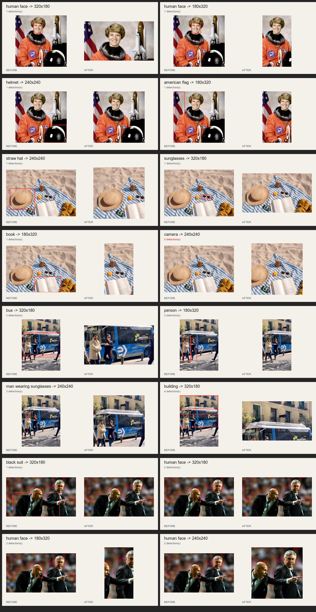

# Semantic Focus Crop Examples



The gallery contains 16 calls to the same public API with different prompts and aspect ratios:

```php
$image->crop($width, $height, focus: $focus);
```

Red boxes show the regions returned by zero-shot object detection. The camera example intentionally has no detection and demonstrates the center-gravity fallback.

## Contents

- `sources/` contains the original images.
- `generated/` contains the cropped output images.
- `comparisons/` contains one labeled before-and-after panel per variation.
- `gallery.jpg` combines every comparison into one contact sheet.
- `manifest.json` records prompts, dimensions, confidence scores, and normalized boxes.
- `generate.php` reproduces the outputs with the locally cached model.

## Sources

- Astronaut and beach images: [Transformers.js documentation dataset](https://huggingface.co/datasets/Xenova/transformers.js-docs)
- Bus and football images: [Ultralytics sample assets](https://github.com/ultralytics/assets)
